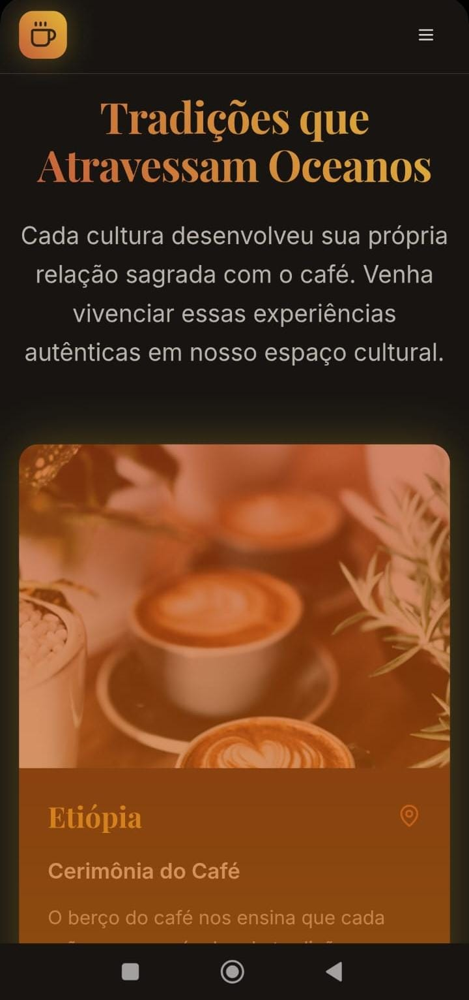

# 🌐 Terra Café - Cafeteria Gourmet Cultural

Este site foi desenvolvido como parte do meu portfólio como Web Designer, com foco em identidade visual e navegação intuitiva.  
O projeto simula um site para uma cafeteria fictícia chamada **Terra Café**, que valoriza experiências culturais autênticas e grãos premium de todo o planeta.




---

## 🧠 Sobre o desenvolvimento

Este projeto foi **criado com o apoio da IA generativa da plataforma Loveble**, que auxiliou na estrutura inicial do código.  
**Todo o conteúdo visual, identidade da marca, ajustes manuais e personalizações foram feitos por mim com curadoria própria.**

Essa escolha faz parte da minha atuação como profissional atualizada com as novas tecnologias e capaz de:

- Utilizar IA para acelerar processos, mantendo a criatividade e o senso estético;
- Realizar edições técnicas diretamente no código;
- Garantir originalidade, navegabilidade e consistência visual;
- Publicar, versionar e manter projetos em ambientes como GitHub e Netlify.

---

## 🛠️ Tecnologias Utilizadas

- **Vite** – Empacotador leve e rápido para aplicações modernas.
- **React** – Biblioteca para construção de interfaces.
- **TypeScript** – Superset do JavaScript com tipagem estática.
- **Tailwind CSS** – Framework utilitário para estilização.
- **shadcn/ui** – Componentes de interface acessíveis e bonitos.

---

## 💻 Como Rodar Localmente

Para executar o projeto na sua máquina, siga os passos abaixo:

```bash
# Clone o repositório
git clone https://github.com/Meirian-Santos/site-terra-cafe.git

# Acesse a pasta do projeto
cd site-terra-cafe

# Instale as dependências
npm install

# Inicie o servidor de desenvolvimento
npm run dev
